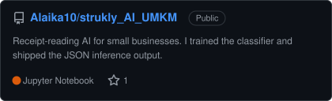

# Collaborations

Most of my team work does not show up on my GitHub profile, because it either lives in someone else's repository or sits in a private one. This is the full list.

<table>
<tr>
<td width="50%"></td>
<td width="50%"></td>
</tr>
<tr>
<td width="50%"></td>
<td width="50%"></td>
</tr>
<tr>
<td width="50%"></td>
<td width="50%"></td>
</tr>
</table>
