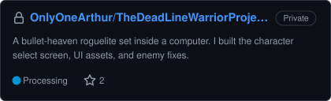
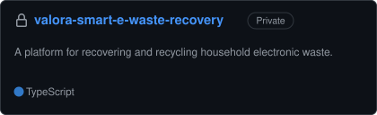
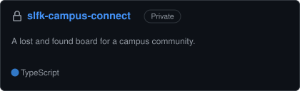
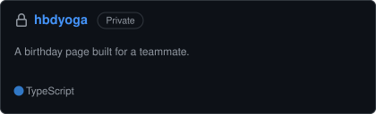

# Collaborations

Most of my team work does not show up on my GitHub profile, because it either lives in someone else's repository or sits in a private one. This is the full list.

<table>
<tr>
<td width="50%"></td>
<td width="50%"></td>
</tr>
<tr>
<td width="50%"></td>
<td width="50%"></td>
</tr>
<tr>
<td width="50%"></td>
<td width="50%"></td>
</tr>
<tr>
<td width="50%"></td>
<td width="50%"></td>
</tr>
</table>

**Live demos** &nbsp;·&nbsp; [UPTERRA](https://upterra.vercel.app) &nbsp;·&nbsp; [RANTAU](https://rantau-website.vercel.app) &nbsp;·&nbsp; [Valora](https://valora-smart-e-waste-recovery-tau.vercel.app) &nbsp;·&nbsp; [Happy Birthday Yoga](https://happy-birthday-yoga.vercel.app)

Cards marked **Private** link to repositories you will not be able to open without access. The live demos above are public.

## Who I worked with

[@OnlyOneArthur](https://github.com/OnlyOneArthur) &nbsp;·&nbsp; [@Alaika10](https://github.com/Alaika10) &nbsp;·&nbsp; [@RennanLucas](https://github.com/RennanLucas) &nbsp;·&nbsp; [@yahya16-rey](https://github.com/yahya16-rey) &nbsp;·&nbsp; [@SicheateR](https://github.com/SicheateR) &nbsp;·&nbsp; [@zahra28sabila-jpg](https://github.com/zahra28sabila-jpg)
